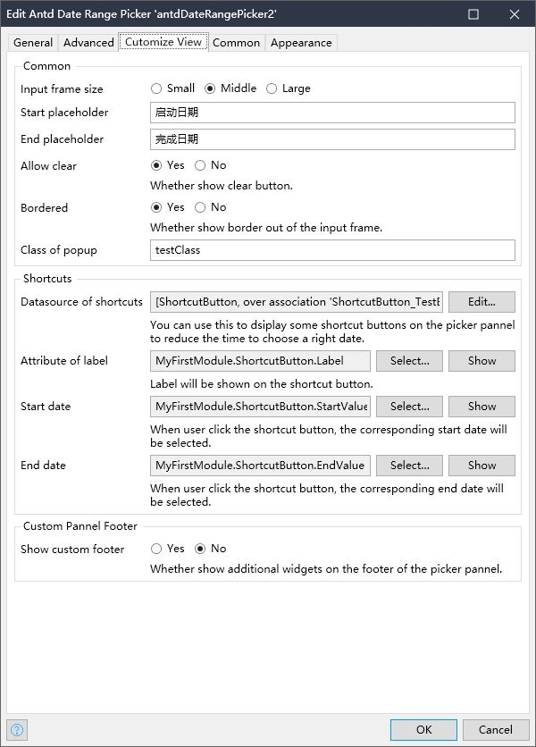

## 介绍

AntdDatePicker（[Github地址](https://github.com/zjh1943/mendix-antd-date-range-picker)）是一个用来选择时间范围的 Mendix Widget，实现了 Ant Design 中的 [`RangePicker`](https://ant.design/components/date-picker-cn#rangepicker) 的绝大部分接口。  

点击这个[在线 Demo](https://github.com/zjh1943/mendx-antd-widgets-show)可在线预览该组件的特性。

## 功能特性

1. 支持多种时间单位的选择，包括：`date`, `week`, `month`, `quarter`, `year`.
2. 支持自定义日期显示格式，比如：`yyyy-DD-mm`, `dddd-DD-mm hh:MM:ss`.
2. 支持添加常用快捷按钮，一键选择时间段。
3. 支持精确到时分秒的时间段选择。
4. 支持自定义不可选择的日期。
5. 支持定义多国语言。
6. 支持 Mendix 的 Validation Feedback 功能。

## 快速安装和使用

### 将该组件添加到 Mendix Project 中
1. 从[这里](https://github.com/zjh1943/mendix-antd-date-range-picker/releases)下载 mpk 文件.
3. 把 mpk 文件复制到你的 Mendix Project 目录 `{YourMendixProjectFolder}/widgets/`.
4. 用 Mendix Studio Pro 打开你的 Mendix Project，然后点击菜单 `Menu > App > Synchronize App Directory`.

### 快速配置组件

1. 选择任意页面，向页面添加一个 `DataView`，并为 `DataView` 设置好 `Datasource`。
2. 向上述 `DataView` 中添加 `Antd Date Range Picker` 组件。可以从 Mendix Studio Pro 的右侧 Toolbox 中找到。
3. 为该组件设置必要的属性。包括： `Picker Type`, `Start time`, `End time`, `On value change` :
    * 设置 `Picker type`。可选择默认的 `Date`。
    * 设置 `Start time` 和 `End time` 为实体的两个属性。用来设置和读取组件的开始和结束时间。
    * 设置 `On value change` 为 `Nanoflow`，选择新建一个 `Nanoflow`。
    * 在该 `Nanoflow` 中读取和打印 `Start time` 和 `End time` 属性。
4. 运行。
## Demo 项目

1. 你可以在[这里](https://demo-antdwidgets-sandbox.mxapps.io/)访问在线 demo。  
2. 也可以从[这里](https://github.com/zjh1943/mendx-antd-widgets-show)下载 demo project，在自己的 Mendix Studio Pro 上启动运行。  

## 详细配置说明

### General

Properties to control the most important behaviors or display of the widget. You will definitely use most of these properties when you add this widget into a page.

* Picker type. Support values: `date`, `week`, `month`, `quarter`, `year`. If you set it as `quarter`，you picker will display like this: 
* Format. The format of DateTime value shown on the input frame. e.g. YYYY/MM/DD HH:mm:ss.
* Start time. The start time value. You need to set a attribute of a entity.
* End time. The end time value. You need to set a attribute of a entity.
* On value Change. Will be triggered when eithter start value or end value is changed.
* Show time. Whether show time picker on the picker pannel. If yes, you'd better add "HH:mm:ss" to the `format` property to show the time part. It looks like this: 
* Plannel placement. On which place is the picker pannel placed to the input frame. support values like: Bottom Left, Bottom Right, Top Left, Top Right.
### Advanced

Properties to control the behavior of the widget, which is not must for normal using.

* Main.
    * Allow start time empty.
    * Allow end time empty.
    * Auto focus. Whether auto get focus when shown.
    * Input readonly. Set the input as readonly.So that, when on mobile device, the virtual keyboard will not be open.
* Locale.
    * Locale. Set the display language. Currently only support zh_CN and en_US.
* Picker Open State.
    * Picker open. An attribute to control the open status of the picker.
    * On open change. Will be triggered when the picker pannel is opened or closed.
* Picker Value. ( not support any more)
    * Default start time. The default start time value on the picker pannel.
    * Default end time. The default end time value on the picker pannel.
* Disable Date. 
    * Disable mode. Disable some dates, so that some invalid dates can not be choosen by user. 
        - 'Off' means no date will be disabled. 
        - 'Positive' means the dates you set below are the only available dates. 
        - 'Negative' means that all the dates excepet for the dates you set below are available.
    * Disable datasource.
    * Disable attribute.
### Customize View

Properties to customize the view of the widget.

* Common.
    - size. Input frame size. Support value: Small, Middle, Large.
    - Start placeholder.
    - End placeholder.
    - Allow clear. Whether show clear button.
    - Bordered. Whether show border out of the input frame.
    - Class of popup. CSS class of the popup DOM element.
* Shortcuts. 
    - Datasource of shortcuts. You can use this to dsiplay some shortcut buttons on the picker pannel to reduce the time to choose a right date.
    - Attribute of label. Label will be shown on the shortcut button.
    - Start date. When user click the shortcut button, the corresponding start date will be selected. 
    - End date. When user click the shortcut button, the corresponding end date will be selected.
* Custom Pannel Footer
    - Show custom footer. Whether show additional widgets on the footer of the picker pannel.
    - Custom pannel footer. Put additional widgets on the footer of the picker pannel.
## 与 `antd` RangePicker 的功能对比

这里列举了 `antd` 中 `RangePicker` 的所有参数，并说明了该组件是否支持该属性，以及不支持的原因。如果想查看`antd`中原属性的含义，请[移步这里](https://ant.design/components/date-picker-cn#rangepicker)。

| antd 组件参数             | 参数说明                                       | 是否支持 | 备注                   |
| --------------------- | ------------------------------------------ | ---- | -------------------- |
| allowEmpty            | 允许起始项部分为空                                  | Y    |                      |
| dateRender            | 自定义日期单元格的内容。info 参数自 4.3.0 添加              | N    | 小概率需求                |
| defaultPickerValue    | 默认面板日期                                     | N    | 在 Mendix 中没有实用价值     |
| defaultValue          | 默认日期                                       | N    | 在 Mendix 中没有实用价值     |
| disabled              | 禁用起始项                                      | Y    |                      |
| disabledTime          | 不可选择的时间                                    | Y    |                      |
| format                | 展示的日期格式                                    | Y    |                      |
| presets               | 预设时间范围快捷选择                                 | Y    |                      |
| renderExtraFooter     | 在面板中添加额外的页脚                                | Y    |                      |
| separator             | 设置分隔符                                      | N    | 小概率需求                |
| showTime              | 增加时间选择功能                                   | Y    |                      |
| showTime.defaultValue | 设置用户选择日期时默认的时分秒，例子                         | N    | 在 Mendix 中没有实用价值     |
| value                 | 日期                                         | Y    |                      |
| onCalendarChange      | 待选日期发生变化的回调。info 参数自 4.4.0 添加              | N    | 在 Mendix 中没有实用价值     |
| onChange              | 日期范围发生变化的回调                                | Y    |                      |
| allowClear            | 是否显示清除按钮                                   | Y    |                      |
| autoFocus             | 自动获取焦点                                     | Y    |                      |
| bordered              | 是否有边框                                      | Y    |                      |
| className             | 选择器 className                              | Y    |                      |
| popupClassName        | 额外的弹出日历 className                          | Y    |                      |
| inputReadOnly         | 设置输入框为只读（避免在移动设备上打开虚拟键盘）                   | Y    |                      |
| locale                | 国际化配置                                      | Y    | 目前仅支持 zh\_CN, en\_US |
| open                  | 控制弹层是否展开                                   | Y    |                      |
| picker                | 设置选择器类型                                    | Y    |                      |
| placeholder           | 输入框提示文字                                    | Y    |                      |
| placement             | 选择框弹出的位置                                   | Y    |                      |
| popupStyle            | 额外的弹出日历样式                                  | N    | 小概率需求                |
| size                  | 输入框大小，large 高度为 40px，small 为 24px，默认是 32px | Y    |                      |
| status                | 设置校验状态                                     | Y    |                      |
| style                 | 自定义输入框样式                                   | Y    |                      |
| onOpenChange          | 弹出日历和关闭日历的回调                               | Y    |                      | 
## Issues, suggestions and feature requests
[link to GitHub issues]

## Development and contribution

1. Install NPM package dependencies by using: `npm install`. If you use NPM v7.x.x, which can be checked by executing `npm -v`, execute: `npm install --legacy-peer-deps`.
1. Run `npm start` to watch for code changes. On every change:
    - the widget will be bundled;
    - the bundle will be included in a `dist` folder in the root directory of the project;
    - the bundle will be included in the `deployment` and `widgets` folder of the Mendix test project.
