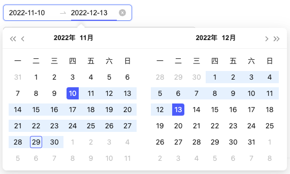
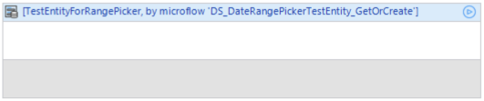
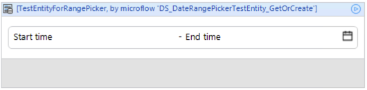
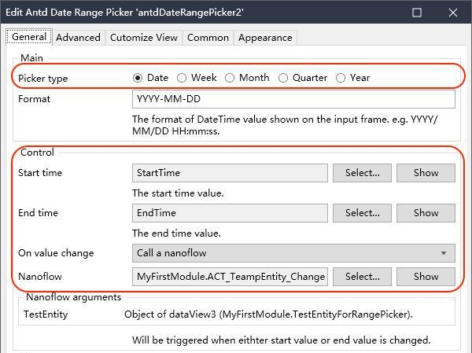
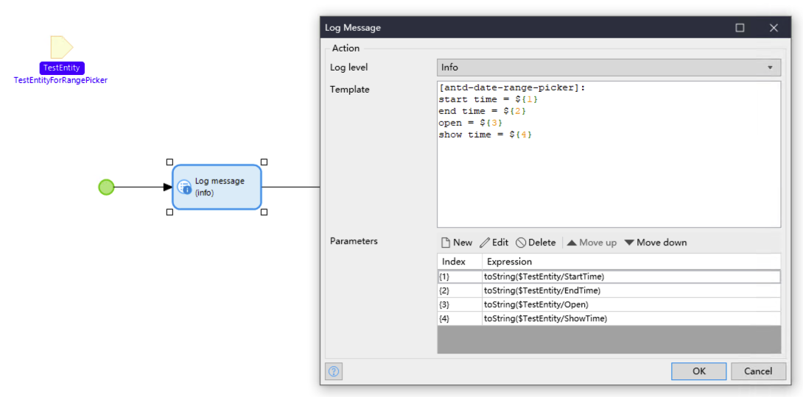
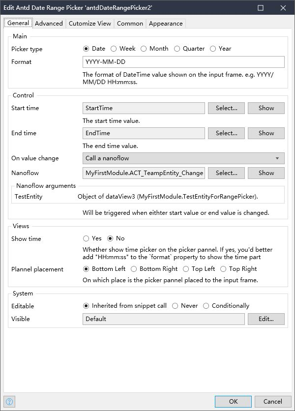
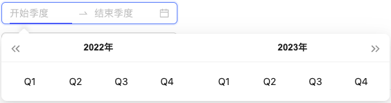
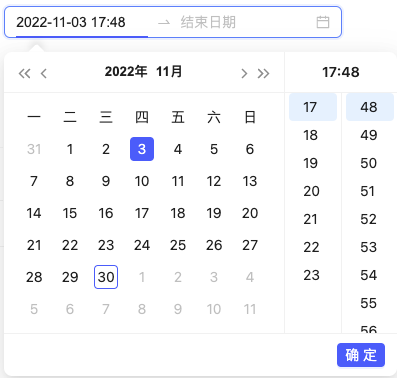
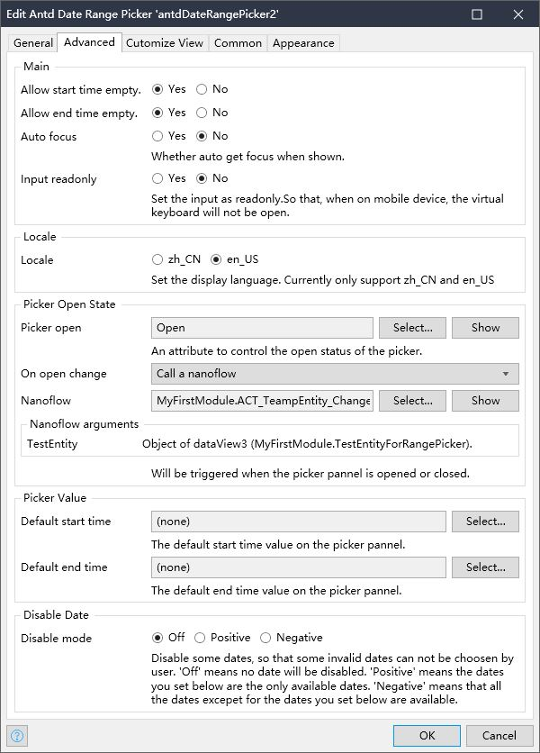
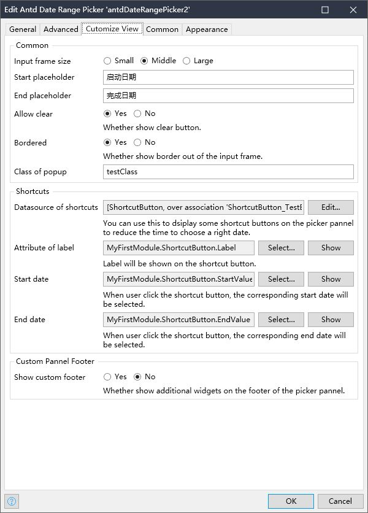

## Introducation

[中文文档](./README-CN.md)  

AntdDatePicker ([Github address](https://github.com/zjh1943/mendix-antd-date-range-picker)) is a Mendix widget for selecting time ranges, and implements most of the interface of [`RangePicker`](https://ant.design/components/date-picker-cn#rangepicker) in Ant Design.   
View features of this project on [online demo](https://demo-antdwidgets100.apps.ap-2a.mendixcloud.com).

## Featrues

1. Support multiple time unit choices, including: `date`, `week`, `month`, `quarter`, `year`.
2. Support custom date display format, such as: `yyyy-DD-mm`, `dddd-DD-mm hh:MM:ss`. 2.
2. Support adding common shortcut buttons to select time period with one click.
3. support time period selection accurate to hours, minutes and seconds.
4. Support customizing non-selectable dates. 
5. Support defining multiple languages. 
6. Support Mendix's Validation Feedback feature.

## Quick Use

### 1. Add this widget to the Mendix Project

1. Download the mpk file from [here](https://github.com/zjh1943/mendix-antd-date-range-picker/releases).
3. Copy the mpk file to your Mendix Project directory `{YourMendixProjectFolder}/widgets/`.
4. Open your Mendix Project with Mendix Studio Pro and click on the menu `Menu > App > Synchronize App Directory`.

### 2. Set properties

1. Select any page, add a `DataView` to the page, and set the `Datasource` for the `DataView`. 
2. Add the `Antd Date Range Picker` widget to the `DataView` above. It can be found in the Toolbox on the right side of Mendix Studio Pro. 
3. Set the necessary properties for the widget, including `Picker Type`, `Start time`, `End time`, `On value change` :
    * Set `Picker type`. Select the default `Date` type.
    * Set `Start time` and `End time` as two properties of an entity. Thess two properties are used to set and read the start and end time of the widget.
    * Set `On value change` to `Nanoflow` and choose `create a new Nanoflow`. 
    * Read and print the `Start time` and `End time` properties in this `Nanoflow`. 
4. Run.

## Demo Project

1. You can access the online demo from [here](https://demo-antdwidgets100.apps.ap-2a.mendixcloud.com) to show the features of this widget.   
2. You can also download the demo project from [here](https://github.com/zjh1943/mendx-antd-widgets-show) to run it on your own PC.
    

## Datail of properties

### General

Properties to control the most important behaviors or display of the widget. You will definitely use most of these properties when you add this widget into a page.

* Picker type. Support values: `date`, `week`, `month`, `quarter`, `year`. If you set it as `quarter`，you picker will display like this: 
* Format. The format of DateTime value shown on the input frame. e.g. YYYY/MM/DD HH:mm:ss.
* Start time. The start time value. You need to set a attribute of a entity.
* End time. The end time value. You need to set a attribute of a entity.
* On value Change. Will be triggered when eithter start value or end value is changed.
* Show time. Whether show time picker on the picker pannel. If yes, you'd better add "HH:mm:ss" to the `format` property to show the time part. It looks like this: 
* Plannel placement. On which place is the picker pannel placed to the input frame. support values like: Bottom Left, Bottom Right, Top Left, Top Right.
### Advanced

Properties to control the behavior of the widget, which is not must for normal using.

* Main.
    * Allow start time empty.
    * Allow end time empty.
    * Auto focus. Whether auto get focus when shown.
    * Input readonly. Set the input as readonly.So that, when on mobile device, the virtual keyboard will not be open.
* Locale.
    * Locale. Set the display language. Currently only support zh_CN and en_US.
* Picker Open State.
    * Picker open. An attribute to control the open status of the picker.
    * On open change. Will be triggered when the picker pannel is opened or closed.
* Picker Value. ( not support any more)
    * Default start time. The default start time value on the picker pannel.
    * Default end time. The default end time value on the picker pannel.
* Disable Date. 
    * Disable mode. Disable some dates, so that some invalid dates can not be choosen by user. 
        - 'Off' means no date will be disabled. 
        - 'Positive' means the dates you set below are the only available dates. 
        - 'Negative' means that all the dates excepet for the dates you set below are available.
    * Disable datasource.
    * Disable attribute.
### Customize View

Properties to customize the view of the widget.

* Common.
    - size. Input frame size. Support value: Small, Middle, Large.
    - Start placeholder.
    - End placeholder.
    - Allow clear. Whether show clear button.
    - Bordered. Whether show border out of the input frame.
    - Class of popup. CSS class of the popup DOM element.
* Shortcuts. 
    - Datasource of shortcuts. You can use this to dsiplay some shortcut buttons on the picker pannel to reduce the time to choose a right date.
    - Attribute of label. Label will be shown on the shortcut button.
    - Start date. When user click the shortcut button, the corresponding start date will be selected. 
    - End date. When user click the shortcut button, the corresponding end date will be selected.
* Custom Pannel Footer
    - Show custom footer. Whether show additional widgets on the footer of the picker pannel.
    - Custom pannel footer. Put additional widgets on the footer of the picker pannel.
## Comparison with `antd` `RangePicker` features

Here is a list of all the properties of `RangePicker` in `antd`, with a description of whether this widget supports the property and why it does not. To see the meaning of the original property in `antd`, please [move here](https://ant.design/components/date-picker-cn#rangepicker).

| antd 组件参数             | 参数说明                                       | 是否支持 | 备注                   |
| --------------------- | ------------------------------------------ | ---- | -------------------- |
| allowEmpty            | 允许起始项部分为空                                  | Y    |                      |
| dateRender            | 自定义日期单元格的内容。info 参数自 4.3.0 添加              | N    | 小概率需求                |
| defaultPickerValue    | 默认面板日期                                     | N    | 在 Mendix 中没有实用价值     |
| defaultValue          | 默认日期                                       | N    | 在 Mendix 中没有实用价值     |
| disabled              | 禁用起始项                                      | Y    |                      |
| disabledTime          | 不可选择的时间                                    | Y    |                      |
| format                | 展示的日期格式                                    | Y    |                      |
| presets               | 预设时间范围快捷选择                                 | Y    |                      |
| renderExtraFooter     | 在面板中添加额外的页脚                                | Y    |                      |
| separator             | 设置分隔符                                      | N    | 小概率需求                |
| showTime              | 增加时间选择功能                                   | Y    |                      |
| showTime.defaultValue | 设置用户选择日期时默认的时分秒，例子                         | N    | 在 Mendix 中没有实用价值     |
| value                 | 日期                                         | Y    |                      |
| onCalendarChange      | 待选日期发生变化的回调。info 参数自 4.4.0 添加              | N    | 在 Mendix 中没有实用价值     |
| onChange              | 日期范围发生变化的回调                                | Y    |                      |
| allowClear            | 是否显示清除按钮                                   | Y    |                      |
| autoFocus             | 自动获取焦点                                     | Y    |                      |
| bordered              | 是否有边框                                      | Y    |                      |
| className             | 选择器 className                              | Y    |                      |
| popupClassName        | 额外的弹出日历 className                          | Y    |                      |
| inputReadOnly         | 设置输入框为只读（避免在移动设备上打开虚拟键盘）                   | Y    |                      |
| locale                | 国际化配置                                      | Y    | 目前仅支持 zh\_CN, en\_US |
| open                  | 控制弹层是否展开                                   | Y    |                      |
| picker                | 设置选择器类型                                    | Y    |                      |
| placeholder           | 输入框提示文字                                    | Y    |                      |
| placement             | 选择框弹出的位置                                   | Y    |                      |
| popupStyle            | 额外的弹出日历样式                                  | N    | 小概率需求                |
| size                  | 输入框大小，large 高度为 40px，small 为 24px，默认是 32px | Y    |                      |
| status                | 设置校验状态                                     | Y    |                      |
| style                 | 自定义输入框样式                                   | Y    |                      |
| onOpenChange          | 弹出日历和关闭日历的回调                               | Y    |                      | 
## Issues, suggestions and feature requests
[Github Issue](https://github.com/zj1943/mendix-antd-date-range-picker/issues)

At the same time, your are welcome to get into the China Technology Forum to get more in Mendix widget development. [check this out](https://marketplace.siemens.com.cn/low-code-community)

## Development and contribution

1. Clone the project locally and install dependencies with `npm install`. If the npm version is v7.x.x, (users can use `npm -v` to check the version), use the following command to install dependencies: `npm install --legacy- peer-deps`.
2. Run npm start in the command line to start bundle the widget:
    * Project started bundling...
    * Wait for the dinner, and the widget will be automatically generated in the dist directory;
    * Developers can modify the package.json, and specify the test project of Mendix. When your dinner is ready, the widget will be automatically synchronized to the `deployment` and `widgets` directories.